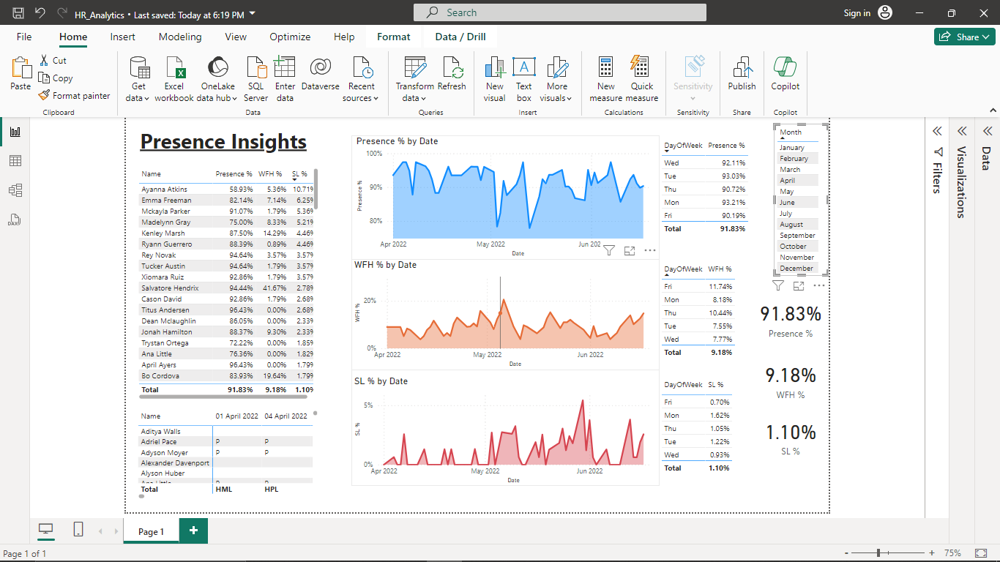

# HR Analytics using Power BI

In this mini-project, real world HR data recording the attendance of employees in a company were processed, cleaned and transformed using Power BI and a Dashboard was created with applicable filters to extract insights and answer questions.

Important metrics such as Presence %, Work-From-Home % and Sick Leave % were calculated as Measures. New columns were introduced in the data pipeline using DAX formulae and were used to create effective and clear dashboard items.

## Dashboard

